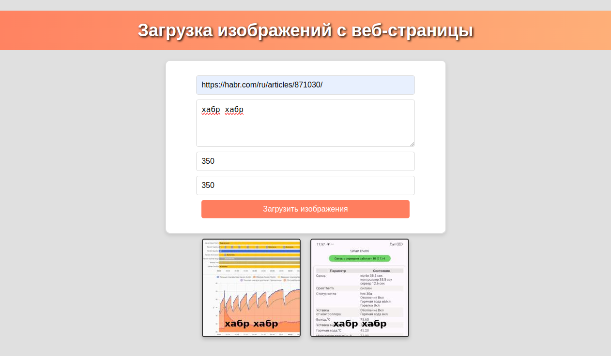

# 🎨 tile-expert

Проект tile-expert — это веб-приложение для загрузки изображений с указанных интернет-страниц, 
их автоматической обработки и вывода в интерактивном формате.

## Функционал

Приложение позволяет:

- Загружать изображения с интернет-страниц по ссылке, с указанием минимальных размеров для фильтрации (меньшие изображения загружаться не будут);
- Обрабатывать загруженные изображения: уменьшение по высоте до 200px, обрезка по ширине до квадрата 200x200px, и наложение произвольного текста на изображение;
- Выводить обработанные изображения на экран через AJAX без перезагрузки страницы;
- Сохранять изображения на сервере, с последующим их выводом при перезагрузке страницы.

## Стек технологий
- PHP 8.3
- Nginx
- Composer
- Docker, Docker Compose

## Установка и запуск

### 1.  Клонируйте репозиторий:

```bash
git clone https://github.com/Andrey-Yurchuk/tile-expert.git
```

### 2. Перейдите в каталог проекта:

```bash
cd tile-expert
```

### 3. Соберите контейнеры и установите зависимости:

```bash
docker-compose build
docker-compose up -d
docker-compose exec php composer install
```

⚠️ Для корректной работы приложения, владельцем и группой файлов проекта должен быть www-data.
Установить соответствующие права можно командой (для Linux дистрибутивов и macOS):

```bash
sudo chown -R www-data:www-data ~/tile-expert/
```

### 4. Откройте в браузере:

```bash
http://localhost:8080
``` 

### Примечание

После выполнения всех шагов, приложение будет готово к использованию. Вы сможете загружать по ссылке изображения, 
обрабатывать их и просматривать результат.

### Скриншот приложения



_На скриншоте выше показан пользовательский интерфейс приложения tile-expert_
